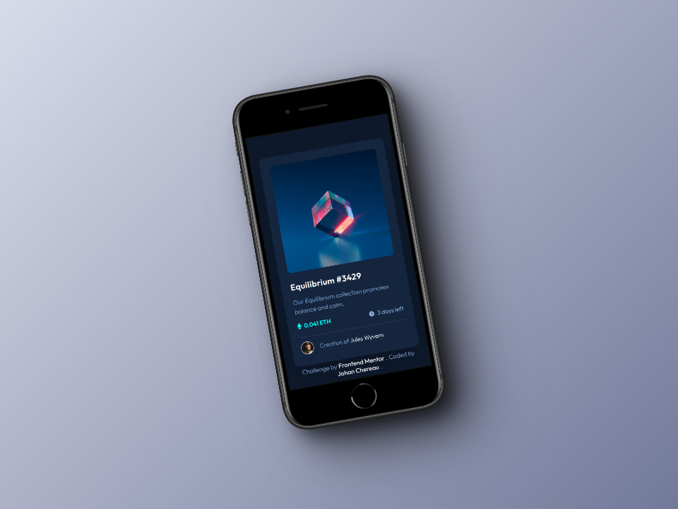
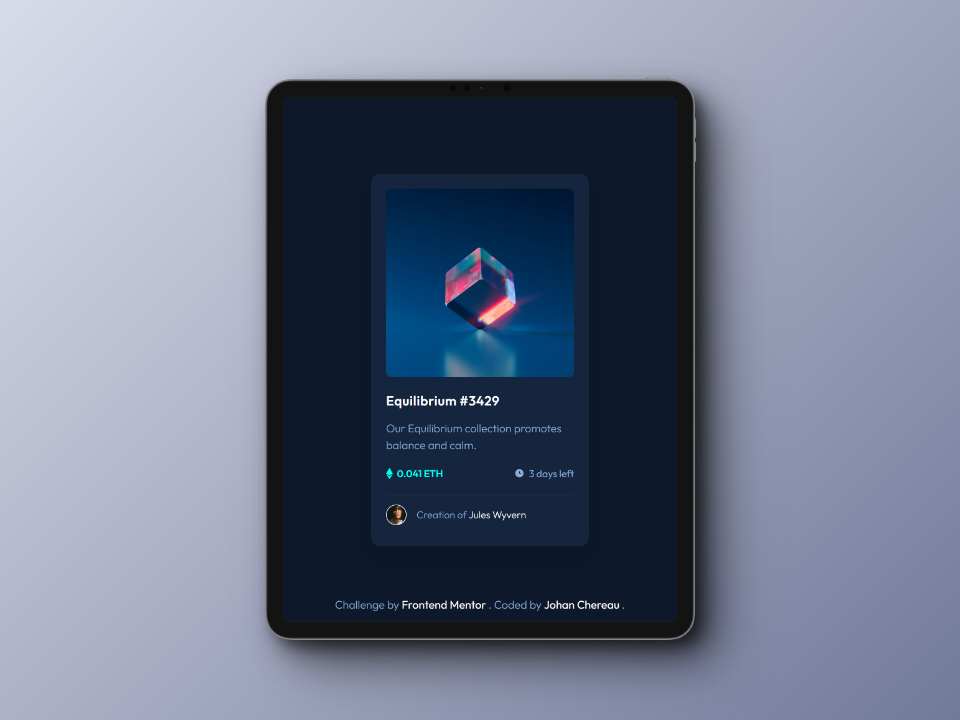
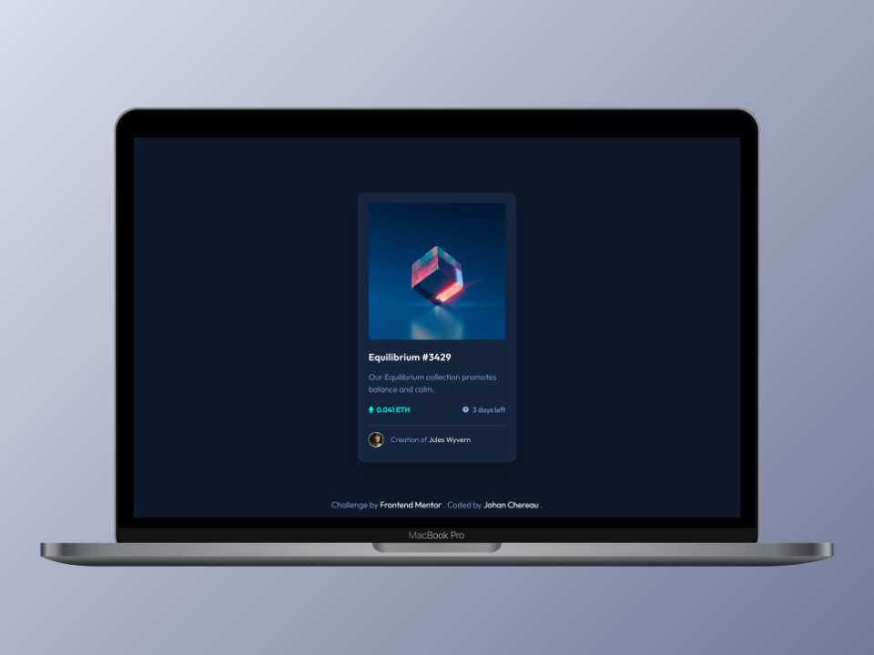

# Frontend Mentor - NFT preview card component solution

This is a solution to the [NFT preview card component challenge on Frontend Mentor](https://www.frontendmentor.io/challenges/nft-preview-card-component-SbdUL_w0U). Frontend Mentor challenges help you improve your coding skills by building realistic projects. 

## Table of contents

- [Overview](#overview)
  - [The challenge](#the-challenge)
  - [Design](#design)
  - [Screenshots](#screenshots)
  - [Links](#links)
- [My process](#my-process)
  - [Built with](#built-with)
  - [What I learned](#what-i-learned)
  - [Useful resources](#useful-resources)
- [Author](#author)

## Overview

### The challenge

Users should be able to:

- View the optimal layout depending on their device's screen size
- See hover states for interactive elements

### Design
#### Design to integrate


### Screenshots
#### Mobile view


#### Tablet view


#### Desktop view


### Links

- Solution on Front End Mentor: [Click here](https://www.frontendmentor.io/solutions/responsive-nft-preview-card-semantic-html-and-css-grid-flexbox-bem-Z4qVTYASRw)
- Live Site URL: [Click here](https://johanchereau.github.io/nft-preview-card-component-main/)

## My process
For this challenge, I first tried to construct my HTML in the most semantic, logical and well-named way possible, using BEM notation. As for CSS, I used custom CSS properties, utility classes for both styling and layout with Flexbox and CSS Grid to be as flexible and comprehensible as possible.

### Built with

- Semantic HTML5 markup
- CSS custom properties
- Flexbox
- CSS Grid
- Mobile-first workflow
- BEM (Block, Element, Modifier)

### What I learned

In particular, I learned how to overlay two images on on top of the other, as shown on the card header. I used an absolute position to cover the entire parent.
```html
<div class="card__header">
          

          <a href="#" class="card__image-hover grid grid-center">
            
          </a>
        </div>
```

```css
.card__header {
  position: relative;
}

.card__image-hover {
  position: absolute;
  top: 0;
  left: 0;
  right: 0;
  bottom: 0;
}
```

### Useful resources

- [CSS-Tricks : CSS Grid](https://css-tricks.com/snippets/css/complete-guide-grid/) - Guide to all CSS grid properties, with examples.
- [CSS-Tricks : Flexbox](https://css-tricks.com/snippets/css/a-guide-to-flexbox/) Guide to all Flexbox properties, with examples.

## Author
- Frontend Mentor - [@JohanChereau](https://www.frontendmentor.io/profile/JohanChereau)
